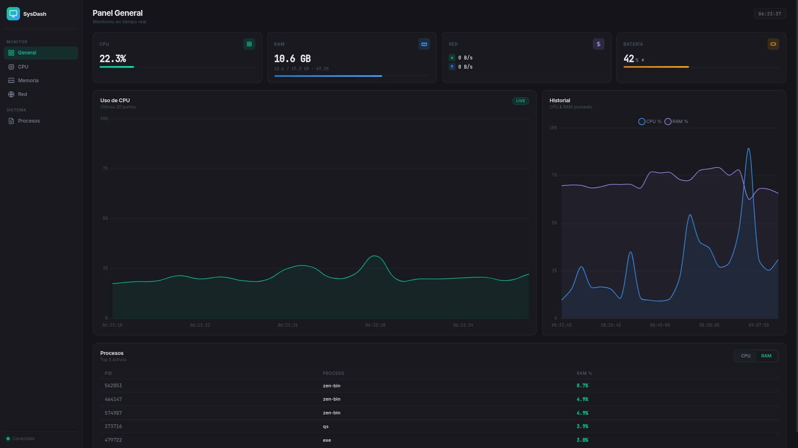

# SysDash

Panel de monitoreo del sistema en tiempo real — CPU, RAM, Red y procesos activos.



## Características

- Visualización en tiempo real de recursos del sistema.
- Gráficos dinámicos con Chart.js.
- Monitoreo de procesos activos.
- Interfaz moderna y profesional.

## Instalación

```bash
yay -S sys-dashboard
```
